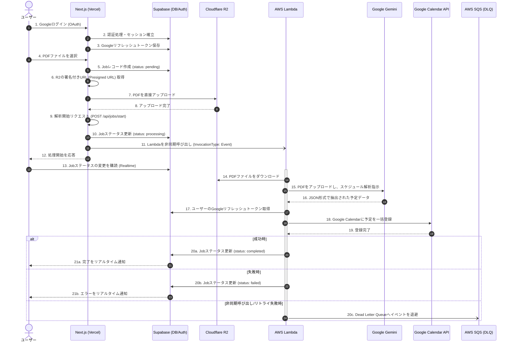

# ゴミカレ (Gomicale) アーキテクチャとデータフロー

このドキュメントでは、「ゴミカレ」アプリケーションのシステム構成とデータフローについて説明します。

## インフラストラクチャアーキテクチャ

システムは以下の主要なコンポーネントで構成されています。

- **フロントエンド / API (BFF)**: Next.js (Vercel)
- **データベース & 認証**: Supabase (PostgreSQL, Supabase Auth)
- **ファイルストレージ**: Cloudflare R2
- **非同期ワーカー**: AWS Lambda
- **エラーキュー**: AWS SQS (Dead Letter Queue)
- **外部サービス**: Google Gemini API (AI解析), Google Calendar API

### LambdaとSQSの作成方法について
AWSインフラストラクチャ（Lambda, SQS DLQ, IAMロールなど）は、リポジトリ内の `infra/lib/gomicale-stack.ts` に定義された **AWS CDK (Cloud Development Kit)** によってコードとして管理 (IaC) されています。デプロイ時（`npx cdk deploy`）に自動的に作成される仕組みとなっています。
SQSは、Lambda関数が非同期呼び出しに失敗した際のエラー退避先（DLQ: Dead Letter Queue）として設定されています。

---

## アーキテクチャ図 (Mermaid)

---

## データフロー図

アップロードからカレンダー登録までの詳細なデータの流れです。

## 各コンポーネントの役割

1. **Next.js (API Routes / Server Actions)**
   - R2への署名付きURL（Presigned URL）の発行
   - SupabaseでのJob（処理ステータス）のレコード管理
   - Lambdaの非同期（Event）呼び出し（AWS SDK `InvokeCommand` を使用）

2. **Cloudflare R2**
   - ユーザーがアップロードした一時的なPDFの保存。Vercelのペイロード制限を回避するため、クライアントから直接アップロードされます。

3. **Supabase**
   - **Auth**: Google OAuth認証とセッション管理
   - **Database**: Jobの進捗ステータス管理、Google API連携用のリフレッシュトークン保存
   - **Realtime**: クライアント側でJobのステータス変更をリアルタイムで購読

4. **AWS Lambda (`gomicale-processor`)**
   - 重い処理（AI解析とAPI通信）をバックグラウンドで実行
   - Gemini APIを使ったPDFからのデータ抽出
   - Google Calendar APIを使った予定の登録処理
   - 処理完了後にSupabaseのJobステータスを更新

5. **AWS SQS (`gomicale-processor-dlq`)**
   - Lambda関数が実行中にクラッシュしたり、リトライの上限に達して処理に失敗した場合のエラーイベントの退避先（Dead Letter Queue）です。AWS CDKの定義によって自動構築されています。
